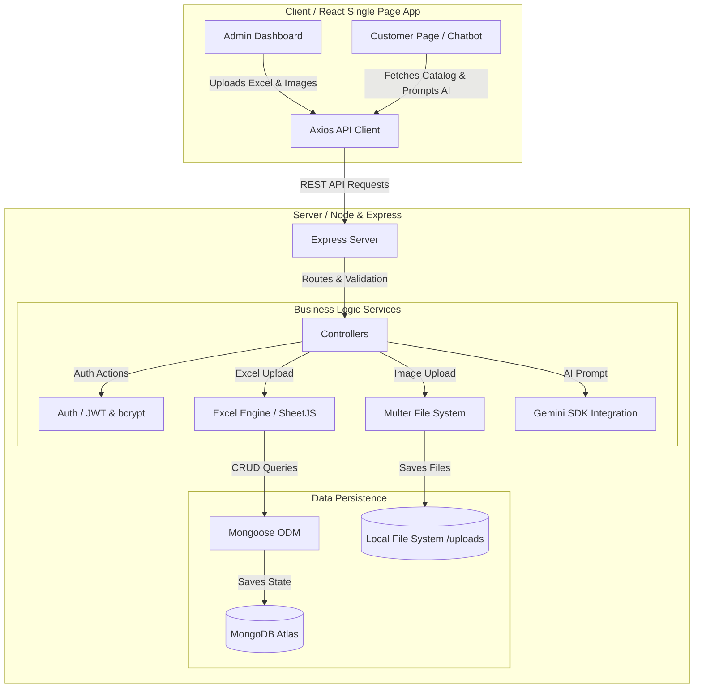

# Architecture Document

## System Architecture Design
The application is designed using a decoupled **MERN (MongoDB, Express, React, Node.js)** architecture. 

### Data Flow Diagram

## Core Components
1. **Frontend Client (Vite + React)**:
   - Built as a client-side routing application.
   - Accesses the backend dynamically using Axios.
2. **Backend Server (Express.js)**:
   - Serves as the central API gateway.
   - Employs middleware for JWT security validation and file parsing.
3. **Database (MongoDB Atlas)**:
   - Document database used to persist product states, user profiles, and administrative logs.
4. **Excel Processing (SheetJS)**:
   - Parses spreadsheets in memory to extract structured product information.
5. **AI Chatbot (Google Gemini API)**:
   - Provides product recommendations and context-aware responses to user queries.
